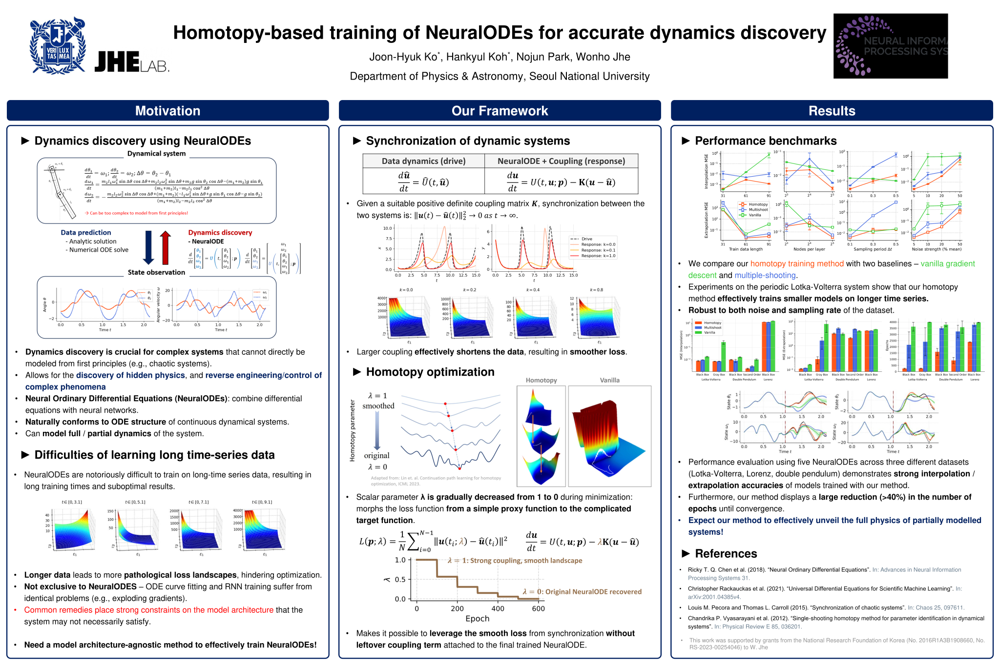

*Homotopy-based training of NeuralODEs for accurate dynamics discovery*
------


This is the repository for the paper,
["Homotopy-based training of NeuralODEs for accurate dynamics discovery", Joon-Hyuk Ko, Hankyul Koh, Nojun Park, and Wonho Jhe.](https://neurips.cc/virtual/2023/poster/70313)
```
ko2023homotopy,
title={Homotopy-based training of NeuralODEs for accuate dynamics discovery},
author={Joon-Hyuk Ko and Hankyul Koh and Nojun Park and Wonho Jhe},
booktitle={Advances in Neural Information Processing Systems},
editor={Amir Globerson and Kate Saenko and Moritz Hardt and Sergey Levine},
volume={37},
year={2023},
url={https://openreview.net/forum?id=rUFckPrzXR}
```
## Requirements
| Dependency | Minimum version | Tested version | Note |
| ---------- | --------------- | -------------- | ---- |
| *python*   | 3.10.0          | 3.11.5         |      |
| *nbformat*| | |  Needed to run the jupyter notebooks. |
| *numpy*    | | 1.26.0 | |
| *matplotlib*| | 3.8.0 | 3.8.2 |
| *more-itertools* | | 10.2.0 | Utilties to work with iterators. |
| *torch*    | 2.0.0           | 2.1.2+cu121    |      |
| *lightning*  | 2.1.0           | 2.1.3          | Manages model training, logging and checkpointing.|
| *wandb*      | 0.16.0          | 0.16.2         | Used with *lightning* for logging purposes.|
| *hydra-core* | 1.3.0           | 1.3.2          | Logs experiment configurations and works with config yaml files to create CLIs for the training scripts.
| *jaxtyping*  | 0.2.25          | 0.2.25         | Used to annotate the shapes of *torch* Tensors.
| *torchdiffeq*| 0.2.3           | 0.2.3          | Provides differentiable ODE solvers to train NeuralODEs.|
| *torch-symplectic-adjoint* (optional)| 0.0.1@beta| 0.0.1@beta | Provides other adjoint methods to compute the gradient. Install with ```pip install git+ssh://git@github.com/tksmatsubara/symplectic-adjoint-method.git@beta```.|
| *scikit-learn* (optional) | | | Needed for the PCA based loss landscape analysis of the NeuralODEs. |

## Usage
The main training scripts for the three datasets considered in the paper are:
- [`train_lotka_volterra.py`](./train_lotka_volterra.py)
- [`train_double_pendulum.py`](./train_double_pendulum.py)
- [`train_lorenz3d.py`](./train_lorenz3d.py)

These can be run from the command line as the following example:
```bash
python train_lotka_volterra.py
```

The default configuration used for training is specified in the corresponding file in the [`configs`](./configs/) folder:
- [`train_lotka_volterra.py`](./train_lotka_volterra.py) &harr; [`lotka_volterra_config.yaml`](./configs/lotka_volterra_config.yaml)
- [`train_double_pendulum.py`](./train_double_pendulum.py) &harr; [`double_pendulum_config.yaml`](./configs/double_pendulum_config.yaml)
- [`train_lorenz3d.py`](./train_lorenz3d.py) &harr; [`lorenz3d_config.yaml`](./configs/lorenz3d_config.yaml)

To run the training script with a different configuration (e.g., homotopy training instead of vanilla), one can either edit the configuration file, or pass the configuration via command line arguments:
```bash
python train_lotka_volterra.py training=homotopy
```

It is also possible to change other aspects of training, such as the model type:
```bash
python train_lotka_volterra.py model=lotka_graybox
```
or more detailed hyperparameters such as the number of hidden nodes inside the model:
```bash
python train_lotka_volterra.py model=lotka_graybox model.nodes_per_layer=10
```

As this functionality is implemented through *hydra*, consult its [documentation](https://hydra.cc/docs/tutorials/basic/your_first_app/defaults/) for more details.


> [!IMPORTANT]
> By default, *wandb* is used to monitor the training run.
> For *wandb* logging to work, one must edit the 'entity' field (and optionally the 'project' field as well) in [`configs/logger/wandb.yaml`](./configs/logger/wandb.yaml) to a [valid value corresponding to the user's *wandb* account (*wandb* username or team name)](https://docs.wandb.ai/guides/runs/manage-runs).

If this is cumbersome, pass none into the logger option:
```bash
python train_lotka_volterra.py logger=none
```
which configures training to only log to the terminal.

## Project structure
The [`node_homotopy` module](./node_homotopy/) contains the core parts of the implementation.

| Submodule | Description&nbsp;&nbsp;&nbsp;&nbsp;&nbsp;&nbsp;&nbsp;&nbsp;&nbsp;&nbsp;&nbsp;&nbsp;&nbsp;&nbsp;&nbsp;&nbsp;&nbsp;&nbsp;&nbsp;&nbsp;&nbsp;&nbsp;&nbsp;&nbsp;&nbsp;&nbsp;&nbsp;&nbsp;&nbsp;&nbsp;&nbsp;&nbsp; | Examples |
| --------- | -----------------| ----------------- |
| [`datasets.py`](./node_homotopy/datasets.py) | Defines *torch* datasets used to train the NeuralODEs. | |
| [`dynamics.py`](./node_homotopy/dynamics.py) | Contains different dynamical systems considered in the study. | [`dynamics.ipynb`](./notebooks/dynamics.ipynb)|
| [`landscape.py`](./node_homotopy/landscape.py) | Codes and utilities to visualize the loss landscape. | [`loss_landscape.ipynb`](./notebooks/loss_landscape.ipynb) |
| [`models.py`](./node_homotopy/models.py) | Implements NeuralODE models used in the study. | |
| [`odesolve.py`](./node_homotopy/odesolve.py) | A wrapper for differentiable ODE solvers from *torchdiffeq* and *torch-symplectic-adjoint*. | |
| [`plotting.py`](./node_homotopy/plotting.py) | Contains plotting functions used for the paper | |
| [`schedules.py`](./node_homotopy/schedules.py) | Implements homotopy schedule used for the NeuralODE training. | [`homotopy.ipynb`](./notebooks/homotopy.ipynb) |
| [`smoothing.py`](./node_homotopy/smoothing.py) | Implements cubic smoothing splines used to create the coupling term. | [`smoothing.ipynb`](./notebooks/smoothing.ipynb) |
| [`synchronization.py`](./node_homotopy/synchronization.py) | Contains code used to synchronize given dynamics with a reference trajectory. | [`synchronization.ipynb`](./notebooks/synchronization.ipynb) |
| [`training.py`](./node_homotopy/training.py) | Implements the three NeuralODE training methods used in the paper. | [`multiple_shooting.ipynb`](./notebooks/multiple_shooting.ipynb) [`homotopy.ipynb`](./notebooks/homotopy.ipynb) |
| [`typealiases.py`](./node_homotopy/typealiases.py) | Contains custom type definitions used for annotations. | |


[`node_homotopy.experiments`](./node_homotopy/experiments/) contains functions and classes to run the actual experiments performed in the paper.
| Submodule | Description&nbsp;&nbsp;&nbsp;&nbsp;&nbsp;&nbsp;&nbsp;&nbsp;&nbsp;&nbsp;&nbsp;&nbsp;&nbsp;&nbsp;&nbsp;&nbsp;&nbsp;&nbsp;&nbsp;&nbsp;&nbsp;&nbsp;&nbsp;&nbsp;&nbsp;&nbsp;&nbsp;&nbsp;&nbsp;&nbsp;&nbsp;&nbsp; | Examples |
| --------- | -----------------| ----------------- |
| [`common.py`](./node_homotopy/experiments/common.py) | Common training utilities shared across experiments for different datasets. | |
| [`double_pendulum.py`](./node_homotopy/experiments/double_pendulum.py) | Functions to setup experiments for the double pendulum dataset. | [`double_pendulum.ipynb`](./notebooks/double_pendulum.ipynb) |
| [`lorenz3d.py`](./node_homotopy/experiments/lorenz3d.py) | Functions to setup experiments for the 3D Lorenz dataset. | [`lorenz3d.ipynb`](./notebooks/lorenz3d.ipynb) |
| [`lotka_volterra.py`](./node_homotopy/experiments/lotka_volterra.py) | Functions to setup experiments for the Lotka-Volterra dataset. | [`lotka_volterra.ipynb`](./notebooks/lotka_volterra.ipynb) |


[`node_homotopy.pyhessian`](./node_homotopy/pyhessian/) is a modified version of the [*PyHessian*](https://github.com/amirgholami/PyHessian) library, which we use to visualize the loss landscape of NeuralODEs.
| Submodule | Description&nbsp;&nbsp;&nbsp;&nbsp;&nbsp;&nbsp;&nbsp;&nbsp;&nbsp;&nbsp;&nbsp;&nbsp;&nbsp;&nbsp;&nbsp;&nbsp;&nbsp;&nbsp;&nbsp;&nbsp;&nbsp;&nbsp;&nbsp;&nbsp;&nbsp;&nbsp;&nbsp;&nbsp;&nbsp;&nbsp;&nbsp;&nbsp; | Examples |
| --------- | -----------------| ----------------- |
| [`hessian.py`](./node_homotopy/pyhessian/hessian.py) | Code for the Hessian computation, modified to work with *lightning* LightningModules. | [`loss_landscapes.ipynb`](./notebooks/loss_landscape.ipynb) |
| [`utils.py`](./node_homotopy/pyhessian/utils.py) | Utilities for the Hessian computation. Identical to the original code. | |

## Examples
Jupyter notebooks containing examples of utilizing different aspects of the code is in the [`notebooks` folder](./notebooks/).

## Disclaimer
The code in this repository is a refactored, documented and cleaned up version of the code used in the original experiments. 

For the original code, consult the `original` branch. Please reach out to jhko725@snu.ac.kr if you have any inqueries.